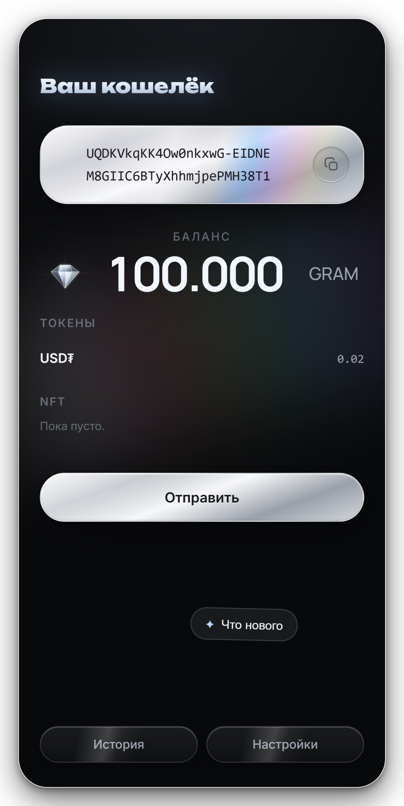
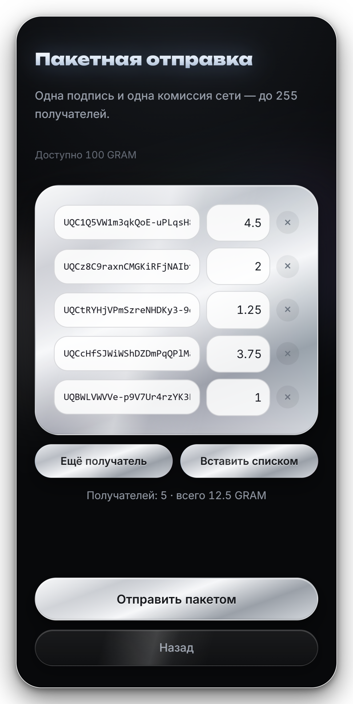
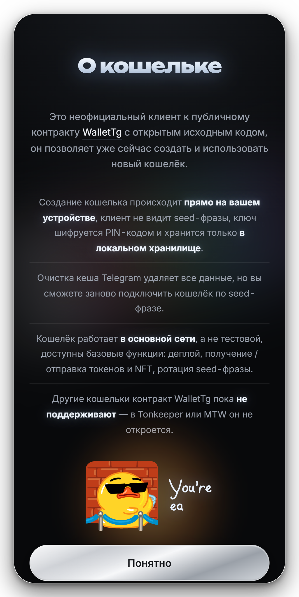
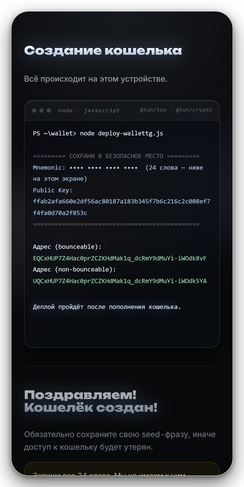
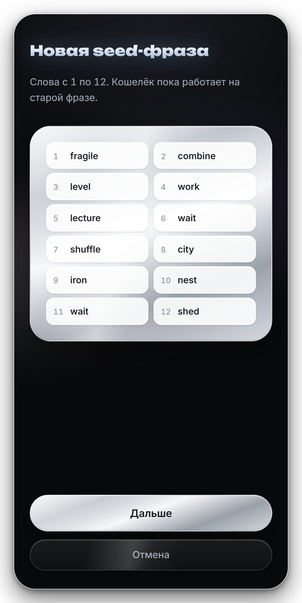

[Русский](README.md) · **English**

# Gram Wallet

Telegram Mini App — a non-custodial GRAM wallet on the WalletTg contract:
https://github.com/ton-blockchain/tg-wallet-contract

The app is unofficial and not affiliated with Telegram. It is a third-party
client for an open contract.

---

## Screens

<table>
<tr>
<td width="50%" align="center"> Wallet</td>
<td width="50%" align="center"> Batch send</td>
</tr>
</table>

<table>
<tr>
<td width="33%" align="center"> About the wallet</td>
<td width="33%" align="center"> Wallet creation</td>
<td width="34%" align="center"> Changing the seed phrase</td>
</tr>
</table>

---

## What it does

Three things ordinary TON wallets do not have. The contract exists for them.

### Change the seed phrase, keep the address

Phrase compromised — rotate it and carry on with the same address. Balance,
history and payment details stay untouched: nobody has to be notified. On v3
and v4 this meant a new wallet and moving every coin to it.

### 255 transfers in one transaction

One signature, one network fee, up to 255 recipients. Payroll, payouts,
airdrops — all in a single batch. Recipients are entered one by one or pasted
as an "address amount" list; the total and the fee are shown before signing.

### Upgrades without migration

The logic lives on-chain and is updated by validator vote. The wallet will not
go stale the way v3 and v4 did — no moving funds to a newer version.

### Everything else a wallet needs

Creation — the 24-word phrase and the key are computed on the device, and the
log prints the same values the console version does.

Deployment — the contract appears on-chain after the first top-up, in a single
operation paid from the wallet itself, in plain view.

Balance, tokens and NFTs — from a public indexer. Images are deliberately not
loaded: the image URL is chosen by the token issuer, and fetching it would
disclose the owner's address to them.

Transfers — GRAM, jettons (TEP-74) and NFTs (TEP-62) from one screen, with a
fee estimate before signing.

History — events in the form explorers show them, every entry links to
Tonviewer.

Recovery — by phrase, or by phrase together with the address after a rotation.
A phrase from Tonkeeper or the Telegram wallet is detected and rejected with
the wallet type and its address, instead of an empty balance.

---

## How it runs

There is no backend at all. Toncenter and ton-access serve CORS, so the
browser talks to the blockchain directly. Vercel serves static files only.

This is a requirement rather than an optimisation: with no server there is no
place where someone else's keys could end up, no logs and no database. Any
server-side function would break the core promise of the app.

The seed phrase lives only in `localStorage`, encrypted with a PIN. Details
are in the Security section.

`Telegram.WebApp.CloudStorage` is never used for the seed phrase — those are
Telegram's servers.

---

## Contract

WalletTg is an open wallet contract that anyone can deploy:
https://github.com/ton-blockchain/tg-wallet-contract

The key difference from the familiar v3 and v4: the key can be changed while
the address stays the same. That is why a backup must contain both the phrase
and the address — after rotation the address can no longer be derived from the
phrase.

---

## Security

The seed phrase is encrypted with AES-GCM-256. The key is derived from the PIN
with Argon2id (32 MB, 3 passes, parallelism 1). Only the ciphertext, salt,
initialisation vector and key derivation parameters reach `localStorage`. The
PIN itself is never stored and never transmitted.

The salt and the vector come from `crypto.getRandomValues` on every save. A
wrong PIN is rejected by the AES-GCM tag check; there is no separate
verification value.

Argon2id was chosen for its memory cost: brute-forcing a short PIN on a GPU
runs into 32 MB per attempt. The module is compiled to WebAssembly and bundled
inline, which is why the CSP allows `'wasm-unsafe-eval'`; `'unsafe-eval'` is
not allowed and `script-src` stays `'self'`. When WebAssembly is unavailable,
the key is derived with PBKDF2-SHA256 at 1.2M iterations, and the chosen
method is recorded in the vault itself.

A forgotten PIN cannot be recovered: only the seed phrase restores access. The
address is stored in the clear — it is public and the lock screen needs it.

---

## Implementation notes

The address cannot be re-derived from the key after rotation. A TON address is
the hash of the initial stateInit with the first public key. After rotation it
stays the same but is no longer computable from the current key, so the
address is stored explicitly and the import screen has a field for it.

Public nodes answer inconsistently. Some return a live account as
`uninitialized` with a zero balance. `getState()` accepts "not deployed" only
after confirmation from several nodes — otherwise the app would attach
stateInit and use seqno 0.

ton-access sticks to one node, so the second provider is toncenter directly:
switching the endpoint has to actually change the source.

External requests must carry `IGNORE_ERRORS`, otherwise the contract rejects
them with error 137. This is checked on the client before sending.
