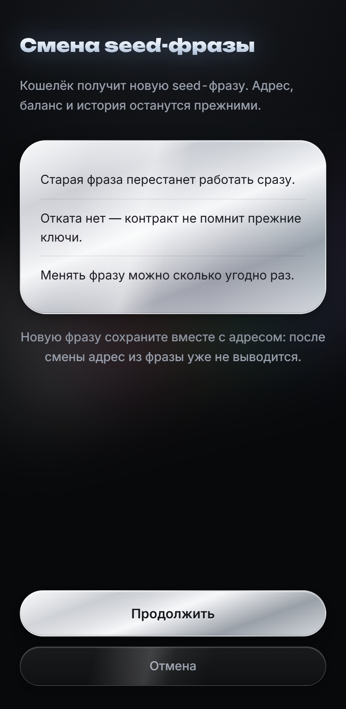

**Русский** · [English](README.en.md)

# Gram Wallet

Telegram Mini App — некастодиальный кошелёк для GRAM на контракте WalletTg:
https://github.com/ton-blockchain/tg-wallet-contract

Приложение неофициальное и не связано с Telegram. Это сторонний клиент
к открытому контракту.

---

## Экраны

| | | | |
| --- | --- | --- | --- |
|  |  |  |  |
| О кошельке | Создание кошелька | Кошелёк | Смена seed-фразы |

---

## Что умеет

Три вещи, которых нет в обычных кошельках TON. Ради них контракт и написан.

### Сменить seed-фразу, не меняя адрес

Фраза скомпрометирована — меняете её и продолжаете работать с тем же адресом.
Баланс, история и реквизиты остаются прежними: никому ничего сообщать не надо.
В v3 и v4 такое означало новый кошелёк и переезд всех средств.

### 255 переводов за одну транзакцию

Одна подпись, одна комиссия сети, до 255 получателей. Зарплаты, выплаты,
раздачи — всё уходит одним пакетом.

### Обновления без переезда

Логика живёт в сети и обновляется голосованием валидаторов. Кошелёк не
устареет так, как устарели v3 и v4 — переносить средства на новую версию
не придётся.

### Всё остальное, что нужно кошельку

Создание — фраза из 24 слов и ключ считаются на устройстве, лог показывает
те же значения, что печатает консольная версия.

Деплой — контракт появляется в сети после первого пополнения, одной операцией
с самого кошелька, на глазах.

Баланс, токены и NFT — из публичного индексатора. Картинки не загружаются
намеренно: ссылку на них выбирает выпускающий токена, и запрос выдал бы ему
адрес владельца.

Переводы — GRAM, жетоны (TEP-74) и NFT (TEP-62) с одного экрана, с оценкой
комиссии до подписи.

История — события в том же виде, в каком их показывают обозреватели, у каждой
операции ссылка в Tonviewer.

Восстановление — по фразе, а после смены ключа по фразе вместе с адресом.
Фразу от Tonkeeper или кошелька Telegram приложение распознаёт и отклоняет,
называя тип кошелька и его адрес, вместо пустого баланса.

---

## На чём работает

Бэкенда нет вообще. Toncenter и ton-access отдают CORS, поэтому браузер
обращается к блокчейну напрямую. Vercel раздаёт только статику.

Это не оптимизация, а требование: нет сервера — нет места, где могли бы
оказаться чужие ключи, нет логов и нет базы. Любая серверная функция сломала бы
главное обещание приложения.

Seed-фраза живёт только в `localStorage`, зашифрованная PIN-кодом.
Подробно — в разделе «Защита».

`Telegram.WebApp.CloudStorage` для seed-фразы не используется никогда — это
серверы Telegram.

---

## Контракт

WalletTg — открытый контракт кошелька, разворачивать его может кто угодно:
https://github.com/ton-blockchain/tg-wallet-contract

Ключевое отличие от привычных v3 и v4: ключ можно менять, а адрес при этом
остаётся прежним. Поэтому резервная копия обязана содержать и фразу, и адрес —
после смены ключа адрес из фразы уже не выводится.

---

## Защита

Seed-фраза шифруется AES-GCM-256. Ключ выводится из PIN через Argon2id
(32 МБ, 3 прохода, параллелизм 1). В `localStorage` попадают только
шифротекст, соль, вектор инициализации и параметры вывода ключа. Сам PIN
не хранится и никуда не передаётся.

Соль и вектор берутся из `crypto.getRandomValues` при каждом сохранении.
Неверный PIN отсекается проверкой тега AES-GCM, отдельной сверки нет.

Argon2id выбран из-за требования к памяти: перебор короткого PIN на
видеокарте упирается в 32 МБ на попытку. Модуль собран в WebAssembly и
вшит в бандл, поэтому в CSP разрешён `'wasm-unsafe-eval'`; `'unsafe-eval'`
не разрешён, `script-src` остаётся `'self'`. Если WebAssembly недоступен,
ключ выводится через PBKDF2-SHA256 с 1,2 млн итераций, и выбранный способ
записывается в само хранилище.

Забытый PIN не восстанавливается: доступ возвращает только seed-фраза.
Адрес хранится в открытом виде — он публичен и нужен экрану блокировки.

---

## Особенности, учтённые в коде

Адрес нельзя выводить из ключа после смены ключа. Адрес в TON — это хеш
начального stateInit с *первым* публичным ключом. После ротации он остаётся
прежним, но из нового ключа не вычисляется. Поэтому адрес хранится явно, а при
импорте есть отдельное поле для него.

Публичные ноды отвечают несогласованно. Часть из них отдаёт живой аккаунт как `uninitialized`
с нулевым балансом. `getState()` принимает «не задеплоен» только после
подтверждения с нескольких нод — иначе приложение прицепило бы stateInit и
взяло seqno 0.

ton-access залипает на одной ноде, поэтому вторым провайдером идёт
toncenter напрямую: смена эндпоинта должна реально менять источник.

External-запросы обязаны нести `IGNORE_ERRORS`, иначе контракт откинет их
с ошибкой 137. Проверяется на клиенте до отправки.
